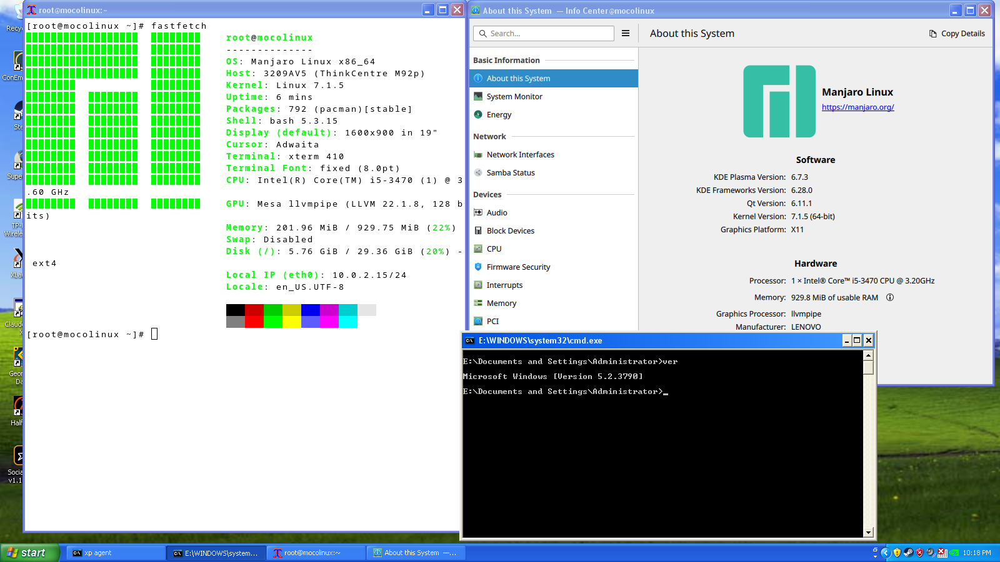
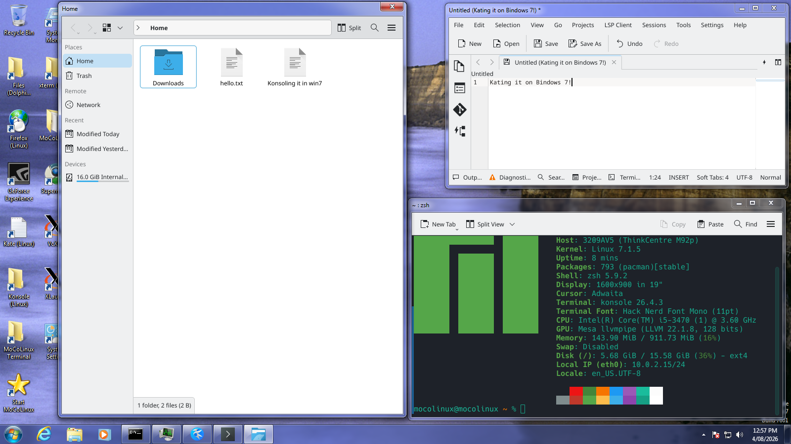
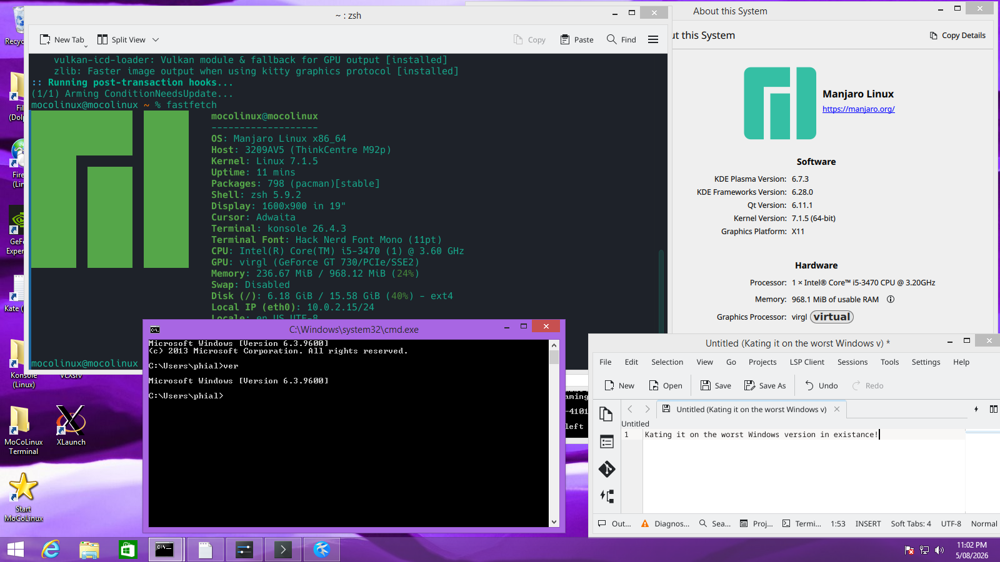
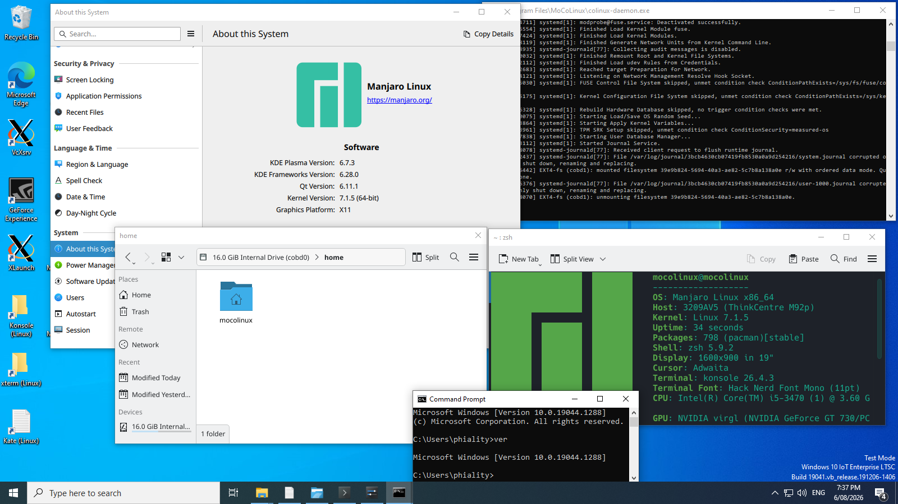
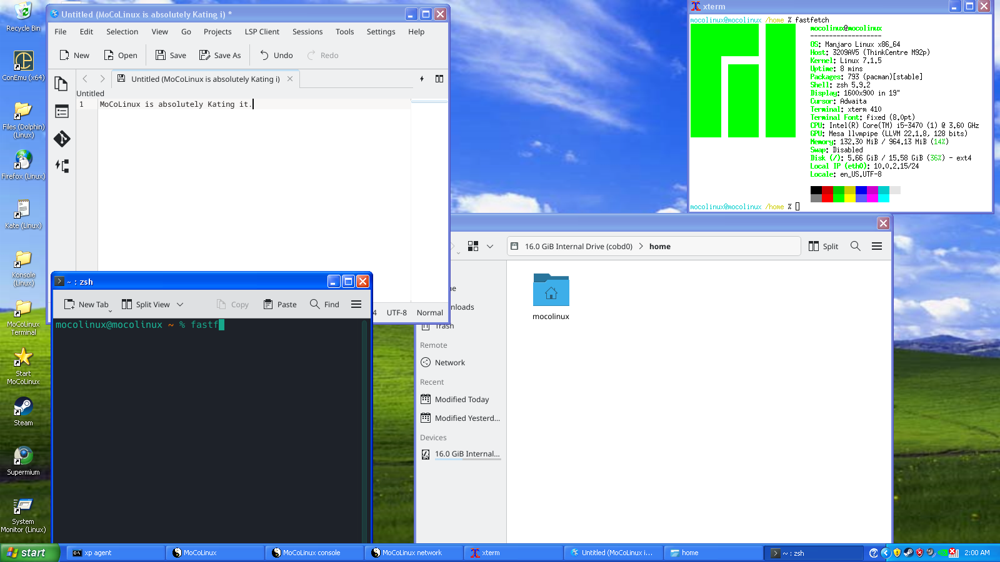

# MoCoLinux

Cooperative Linux for x86-64: a modern Linux kernel running as a guest inside
Windows XP x64, Windows 7 x64, Windows 8.1 x64 and Windows 10 x64 on real
hardware, without a
hypervisor, emulation, or virtualization extensions. It is a port of
[coLinux](http://colinux.org/) (i386, unmaintained since ~2011) to x86-64,
against a 2026 kernel.

```
[root@mocolinux ~]# systemctl is-system-running
running
[root@mocolinux ~]# fastfetch
  OS: Manjaro Linux x86_64
  Host: 3209AV5 (ThinkCentre M92p)
  Kernel: Linux 7.1.5
  Packages: 792 (pacman)[stable]
  Memory: 201.96 MiB / 929.75 MiB (22%)
  Disk (/): 5.76 GiB / 29.36 GiB (20%) - ext4
  Local IP (eth0): 10.0.2.15/24
```



The screenshot is one machine: KDE Plasma 6.7.3 applications and `cmd.exe`
(Windows 5.2.3790) sharing the same desktop and taskbar. No X server runs in
the guest — applications are X clients talking to a VcXsrv on the Windows side
in multiwindow mode (`DISPLAY=10.0.2.2:0`; slirp rewrites that address to the
host's loopback).



The same driver, kernel and root image on Windows 7 x64 — Dolphin, Kate and
Konsole with Aero frames and taskbar buttons, `fastfetch` reporting the
ThinkCentre's own i5-3470.



And the same again on Windows 8.1 x64, `cmd.exe` reporting 6.3.9600 next to
KDE's own report of the card.



And on Windows 10 IoT Enterprise LTSC (10.0.19044), with KVA Shadow (KPTI)
active. One binary serves all four hosts: XP ignores embedded signatures, while
Windows 7, 8.1 and 10 accept the same test-signed driver once
`bcdedit /set testsigning on` is in force, which Setup does for you. 8.1 and 10
ask for a little more — see [Windows 8 and 8.1](#windows-8-and-81) and
[Windows 10](#windows-10).

## How it works

There is no guest-physical address space, no shadow page tables, no VT-x. Both
kernels run at ring 0 on the bare processor; a **world switch** swaps the full
CPU context (CR0/CR2/CR3/CR4/CR8, GDT, IDT, LDT, TR, segment selectors, per-CPU
MSRs, debug registers, FPU state) between them. The guest is trusted, like a
driver, because it runs with kernel privilege.

```
  Windows XP x64                          Linux 7.1.5
  ─────────────                           ───────────
  colinux-daemon.exe ──ioctl──►  linux.sys
                                    │
                                    │  co_switch_full  ◄─── the passage page:
                                    ▼                       mapped at the same
                              [ world switch ]              address in BOTH
                                    │                       address spaces
                                    ▼
                              guest kernel ──► ring 3 processes
```

The **passage page** is a handful of pages mapped at an identical virtual
address on both sides, holding the switch code, both saved CPU states, an IST
stack, a TSS and the console ring — valid mid-crossing, when CR3 has changed
but nothing else has.

Guest RAM is a dense pseudo-physical address space backed by ordinary scattered
nonpaged-pool pages. A host-built p2m table converts each Linux PFN to the
machine PFN placed in hardware page tables; a reverse m2p hash converts values
back when Linux reads those tables. The synthesized e820 therefore describes
RAM from pseudo address zero and does not expose host fragmentation.

### Networking

The guest has an ordinary ethernet device backed by two lock-free byte rings in
its own `.bss` (one writer per word per direction). Frames are stored whole:
32-bit length, frame, padding to a 4-byte boundary, never straddling the wrap.

```
  guest: conet_colinux.c            host: kernel/net.c        colinux-slirp-net-daemon -R
  ────────────────────              ──────────────────        ───────────────────────────
  ndo_start_xmit ─► TX ring ──►  CONET_DUMP / CONET_TAKE ──►  slirp_input
                                 (walk the guest's tables                │
  RX kthread  ◄── RX ring  ◄───   under net_lock)          ◄── slirp_output ──► winsock
```

The host reads the rings by walking the guest's page tables; the base address
is retired under a lock before the address space is freed. NAT is coLinux's
vendored slirp, run in a process confined to a 2 GB address space so its
32-bit queue links can hold pointers. `-r tcp:2222:22` redirects a host port
into the guest (the image runs sshd, which is a far better instrument than a
serial console for diagnosing anything graphical).

### Graphics

The guest has a real GPU device: virtio-gpu, render-only, over a transport
with no traps in it. MMIO transports work because a store to a fake register
traps; nothing traps in this design, so every "register" is a plain store
into a structure in guest RAM, and the kick is a counter that
`cogpu-daemon.exe` spin-polls from another core. No ioctl and no world switch
in the submission path — 2000 context round trips from a guest client measure
a 3 µs median.

```
  guest: Mesa/virgl ─► virtio rings in guest RAM ◄── cogpu-daemon.exe
         /dev/dri/renderD128                          │ (persistent user-mode
                                                      │  windows onto guest RAM)
                                                      ▼
                                            virglrenderer ─► WGL ─► the card
```

The daemon maps the whole of guest RAM into its own address space through
persistent user-mode windows (KMAP, 8 MB slices), so it parses requests and
writes replies in place, and a resource's backing — the guest's list of
{guest physical address, length} — becomes iovecs pointing straight into the
guest's pages. Zero copies on the command path. virglrenderer, cross-built
for mingw behind a WGL winsys, replays the guest's GL onto the host's actual
card: the guest reports `virgl (GeForce GT 730/PCIe/SSE2)`, GL 4.2, where
indirect GLX gave it 1.4 in software.

Presentation is VirtualGL: applications run through the `moco-gl` wrapper,
render on `/dev/dri/renderD128`, and the finished frames are pushed into the
same VcXsrv windows, so windows stay native and rootless while the drawing
happens on the GPU. Every desktop shortcut is wrapped — a program that issues
no GL call loses nothing, and one that does never falls back to llvmpipe.

## Status

Working, verified on hardware (Lenovo ThinkCentre M92p, i5-3470) under Windows
XP x64, Windows 7 x64, Windows 8.1 x64 and Windows 10 x64 — see [Windows 8
and 8.1](#windows-8-and-81) and [Windows 10](#windows-10) for what those hosts
ask for:

- Boots Manjaro with systemd to multi-user target, no failed units, from an
  image the tree builds (`tools/mkmanjarorootfs.sh`)
- ext4 root over a cooperative block device; ring-3 processes
- Interactive terminal over TCP (hvc console, `/dev/hvc0`)
- KDE applications as native Windows windows, rootless, over a host-side X
  server
- Preemption: the host interrupts a busy-looping task; time advances at real
  speed
- Cooperative SMP: the installed launcher requests `--cpus 2`; two Linux
  processors run concurrently on distinct host cores with per-vCPU switch
  state, passage pages, timers and posted-IPI delivery
- Networking: guest ethernet device, host NAT, static address via
  `systemd-networkd`; pacman installs a 791-package desktop over HTTPS at
  16 MB/s
- Hardware-accelerated OpenGL on the host's card: virtio-gpu in the guest,
  virglrenderer on the host, VirtualGL to the windows. Firefox renders through
  virgl on the GT 730 with zero renderer errors; guest Xorg with glamor
  reports direct rendering; `colinux-daemon --run moco-gl glxgears` — the
  exact command a desktop shortcut issues — draws at 128 fps
- Inbound port redirects (`-r tcp:2222:22` reaches the guest's sshd)
- 32-bit binaries (the guest keeps its own `int $0x80` gate)
- Landlock and user namespaces (required by pacman 7 and modern sandboxes)
- Virtual time from the host clock; clean shutdown; stop-on-demand from
  another process
- Hardware interrupts are forwarded across the switch and replayed into
  Windows' live IDT
- Asynchronous block I/O on kernel worker threads (one queue and worker per
  unit); console latency stays at 16–125 ms through a full package install.
  `--sync-cobd` restores the synchronous path for comparison
- Self-installing: `mocolinux-setup.exe` lays down driver, daemons, kernel,
  the GPU daemon with virglrenderer, X server and launchers, then boots Linux
  and builds a Manjaro system on a fresh image over the network

Not yet:

- SMP beyond two vCPUs, long-duration desktop/Steam soaking, and evaluation of
  one-shot/NO_HZ clock events. The two-vCPU path is functional and benchmarked
- The coLinux message layer (`co_monitor_t`, queues, reactor), so upstream's
  `cocon`/`conet` consoles and devices — including `colinux-console-nt` —
  cannot attach
- DHCP in the guest (static address only)
- Presentation off TCP. The drawing happens on the GPU, but every finished
  frame still reaches the screen through VirtualGL's image transport over the
  X protocol, through slirp's NAT — a userspace TCP stack is now the
  frame-rate ceiling on a path that ends at a real card. The plan is to take
  presentation off TCP entirely and hand frames to the host through guest
  RAM, the same zero-copy R3 windows the GPU command stream already rides
  (parked on the `r6-window-presentation` branch)
- A repaired incremental patch series: `patch/7.1.5/current-tree-snapshot.diff`
  is the authoritative guest-side diff and is deliberately not in `series`.
  It is regenerated against the released tarball and checked by
  reverse-applying it to `ref/linux-7.1.5`, so "the snapshot is behind the
  tree" is a thing that gets caught rather than discovered later

### Cooperative SMP milestone

To the project's knowledge, MoCoLinux is the first coLinux-style cooperative
kernel to run a working SMP Linux guest on Windows 10. This is guest SMP, not
merely a uniprocessor guest running on an SMP host: Linux reports CPUs 0 and 1
online and schedules useful work on both simultaneously. Upstream coLinux
[documented that its guest could use only one CPU](https://colinux.fandom.com/wiki/FAQ#Q39._Does_coLinux_take_advantage_of_dual_core_processors?)
and its changelog records that the daemon was
[pinned to the first processor while SMP remained unresolved](https://colinux.sourceforge.net/?section=changelog).

The first validated two-vCPU run was recorded on 2026-08-09 on the ThinkCentre
M92p (Core i5-3470, four physical cores, no SMT), Windows 10 IoT Enterprise
LTSC 21H2 build 19044, and Linux 7.1.5. Each result compares the same running
guest with one worker against two; higher is better:

| Workload | 1 vCPU | 2 vCPUs | Gain |
| --- | ---: | ---: | ---: |
| `sysbench cpu --cpu-max-prime=20000`, 10 s | 345.23 events/s | 682.96 events/s | **1.978x** |
| `openssl speed -evp sha256`, 8192-byte blocks | 320,064.72 kB/s | 634,843.21 kB/s | **1.983x** |
| `sysbench memory` sequential write, 1 MiB blocks | 17,631.70 MiB/s | 35,828.47 MiB/s | **2.032x** |
| `sysbench memory` sequential read, 1 MiB blocks | 21,729.63 MiB/s | 42,494.90 MiB/s | **1.956x** |

The memory figures are a hot-buffer/cache-path scaling test, not a claim about
the M92p's raw DRAM bandwidth. Stability and scheduling checks completed too:

- A 20-second two-worker `stress-ng` matrix run accumulated 39.65 CPU-seconds
  and passed both workers, showing that both vCPUs stayed busy for the full run.
- Four oversubscribed context-switch workers completed 3,275,146 operations in
  10.02 seconds (327,349/s), with no failed or untrustworthy metrics.
- A lock/yield-heavy two-thread sysbench run completed 35,432 events in exactly
  10 seconds, with 0.56 ms average latency and balanced workers.
- Firefox, the workload that previously drove both processors into a hard
  deadlock, loaded pages normally after the posted-IPI polling fix. The guest
  remained reachable over SSH after every test, and a post-stress two-second
  sleep measured 2.023 seconds.

The mechanism follows the useful parts of Xen PV's shape without pretending an
APIC exists. A posted per-vCPU bitmap is the message; a targeted Windows DPC is
the doorbell that interrupts a running target core. A separate targeted 100 Hz
deadline guarantees that a userspace-bound vCPU crosses to the monitor, where a
guarded cooperative interrupt entry batches the guest's 1 ms clock events.
Kernel spin waits poll posted vectors without allowing re-entry from NMI,
hardirq or virtual-interrupt-off regions. CPU scaling is therefore solved for
two vCPUs; presentation frame rate remains limited by the separate GPU-to-X
transport described above.

The fragmented-RAM fix is now in tree: the boot path no longer calls
`MmAllocateContiguousMemory` for guest RAM. It allocates virtually contiguous
cached-pool chunks, records every machine frame independently, and maps the
guest at 4 KB granularity. The host-side and Linux 7.1.5 builds pass; repeated
boot/teardown soaking on the target Windows machines is still required.

## Layout

| Path | What |
| --- | --- |
| `src/colinux/arch/x86_64/switch.c` | the world switch, fault stubs, monitor loop |
| `src/colinux/kernel/kload.c` | loads vmlinux into host memory, builds the guest's tables |
| `src/colinux/kernel/cobd.c` | cooperative block device, host half |
| `src/colinux/kernel/console.c` | terminal rings, host half |
| `src/colinux/kernel/net.c` | network rings, host half — read, consume, inject |
| `src/colinux/kernel/vgpu.c` | virtio-gpu transport, host half — publish, retire, idle gate |
| `src/colinux/os/winnt/user/cogpu-daemon/` | the GPU device: vring service, virglrenderer, the WGL winsys |
| `src/colinux/user/conet_ring.c` | the ring format and its decoder, shared by both readers |
| `src/colinux/user/slirp/` | vendored slirp, with its Win64 repairs |
| `src/colinux/user/elf_load.c` | the daemon: ELF loading, symbol resolution, boot |
| `patch/7.1.5/current-tree-snapshot.diff` | the complete guest-side kernel patch, including cooperative SMP/IPIs, conet, async COBD and the trapless virtio-GPU transport |
| `patch/7.1.5/{async-cobd-src,vgpu-src}/` | standalone development copies of the guest device sources already folded into the cumulative patch |
| `tools/mkmanjarorootfs.sh` | builds the Manjaro desktop image |
| `tools/mkrootfs.sh` | builds the minimal BusyBox bring-up image |
| `tools/coterm.py` | client for the guest's console port |
| `tools/shot.cs` | screenshots the host desktop, compiled and run on the box |
| `tools/decode-minidump.py` | attribute a bugcheck's stack to this driver |
| `tools/pe-clear-laa.py` | confine the slirp daemon to 2 GB of address space |
| `doc/runbook` | box to desktop, and host to installed Manjaro |
| `doc/porting-x86_64` | design notes for the port |
| `doc/building-modern` | the working build recipe |

## Building

Requires a cross toolchain (`mingw-w64-gcc`, `binutils`), `osslsigncode` for
the driver signature, and two kernel trees: the Windows side builds against
2.6.33 headers (the passage-page ABI is a header inside the guest kernel
tree), while the guest kernel is 7.1.5. The 2.6.33 tree is used for headers
only — nothing in it is built or run.

The Windows side, driver through release, is one script:

```sh
tools/build.sh                    # build, sign, stage into dist-x64/
tools/build.sh --release 0.5.0    # ...and assemble release/MoCoLinux-0.5.0/
```

`build.sh` compiles the driver and daemons, builds the installer, signs the
driver with the test cert (NT 6 and later refuse the unsigned image the linker
emits), and stages a set it checks for completeness — the binaries, the
`virglrenderer`/`libepoxy` DLLs the GPU daemon loads, the launchers, and the
guest-side `coxwire` shim. `--release` then assembles a directory whose
manifest is read out of the installer's own payload list, refusing to finish
if anything is missing, links the Universal CRT (it will not start on XP), or
depends on a DLL the release does not carry.

It finds the 2.6.33 header tree and the `download/prefix-mingw` cross prefix by
their default locations; `COLINUX_TARGET_KERNEL_SOURCE` and
`COLINUX_VIRGL_PREFIX` override. It does **not** build `vmlinux` or
`root-arch.img` — both are slow and change rarely — and reports whether the
staged copies are present.

To drive `comake` directly, or for the underlying recipe and every
environment variable, see `doc/building-modern`. The guest kernel is separate:
apply `patch/7.1.5/current-tree-snapshot.diff` to a 7.1.5 tree and build
`vmlinux` normally. The patch defaults `CONFIG_VIRTIO_COLINUX` on; verify that
it is built in, not a module. `CONFIG_KASAN` must be off — the host's allocation
lands in PML4 slot 501, inside Linux's KASAN shadow region.

## Running

The short way, on the target machine: run `mocolinux-setup.exe`. It installs
the driver, daemons, kernel, VcXsrv and launchers, creates desktop shortcuts
and a logon entry, then boots Linux and builds a Manjaro system on a fresh
disk image over the network (~15 minutes, ~2.5 GB of downloads — the release
carries no built desktop, only the seed).



The long way, which is what the installer runs and what to use while
developing:

```
colinux-daemon.exe --boot-kernel vmlinux --max-switches none \
                   --cpus 2 \
                   --cobd0 \??\C:\path\to\root.img
colinux-daemon.exe --console 2323          (a second process: a terminal)
colinux-slirp-net-daemon.exe -R            (a third: NAT for the guest)
cogpu-daemon.exe                           (a fourth: the guest's GPU)
colinux-daemon.exe --run konsole           (start one app in a running guest)
```

- `--mem MB` sets usable pseudo RAM (default 1024). It is a target: e820
  describes what the scattered nonpaged-pool backing actually supplied, and
  falling short is reported rather than fatal.
- `--cpus N` sets the guest's processor count (the daemon default is one; the
  installed launcher requests two). Every vCPU needs a distinct host core, and
  the driver reserves capacity for Windows and the GPU daemon instead of
  oversubscribing a core carrying another guest processor.
- The image ships `10-eth0.network` with slirp's fixed layout and
  `systemd-networkd` enabled, so the guest configures its own network at boot.
- For a desktop, start an X server on the Windows side in multiwindow mode
  (`vcxsrv :0 -multiwindow -ac`, or `dist-x64/xstart.bat`) and run X clients
  in the guest. `DISPLAY=10.0.2.2:0` is already in the image's environment.
  Run GL applications through `moco-gl` (every installed shortcut already
  does); `moco-gl glxinfo | grep renderer` is how to check the card is
  actually being used rather than trusting it.
- `tools/mkrootfs.sh` builds the minimal BusyBox image (`--init /bin/sh`);
  `tools/mkmanjarorootfs.sh` builds the Manjaro desktop image (needs a Linux
  host with `pacman` and `e2fsprogs`; handles the alpm skeleton, package
  install, keyring, `ldconfig`, network unit, fonts and `lib32` packages).
- The daemon processes are separate on purpose: the one running the guest sits
  inside a single ioctl for the guest's lifetime and cannot also service a
  socket. End a session with `colinux-daemon.exe --stop`, a `poweroff` in the
  guest, or by unloading the driver.
- `--net-dump` prints the guest's network rings and decodes their frames
  read-only; `--net-take` does the same and consumes them.

## Windows 8 and 8.1

Supported and verified on hardware, with everything the XP and 7 hosts do —
including hardware-accelerated OpenGL on the host's card (screenshot above).

Two of the following apply to Windows 7 as well, which is NT 6.1: it wants
testsigning and it has UAC. The other two are what 8.1 adds. The installer
handles all four and refuses to continue rather than half-install if it cannot:

- **Secure Boot must be off** *(8.1)*. A test-signed driver cannot load with it
  on, and nothing later in the install can work around that, so the suitability
  check stops there with the firmware steps spelled out.
- **Test signing must be on** *(7 and 8.1)*. The installer enables it and
  reboots; the driver *service* is created after that reboot, not before,
  because creating it while signing is still enforced leaves a service that can
  never start.
- **No hypervisor** *(8.1)*. Hyper-V, VBS/HVCI or a running VM means the guest
  is not at ring 0 on real hardware. Checked via CPUID leaf 1 ECX bit 31.
- **Elevation** *(7 and 8.1)*. `mocolinux-setup.exe` carries a
  `requireAdministrator`
  manifest. The logon entry cannot: UAC runs Startup-folder shortcuts with the
  filtered token, so `moco-boot.vbs` re-launches itself through the `runas`
  verb on NT 6 and later. Without that the X server came up, the desktop looked
  like a working install, `sc start CoLinuxDriver` was silently refused, and
  only the Linux half was missing.

Two smaller differences from XP:

- **No telnet client.** It has been an optional Windows feature, off by
  default, since Vista. The terminal shortcut goes through `moco-term.bat`,
  which offers to enable it and otherwise says which box to tick.
- **User-space mappings land above 4 GB.** XP and 7 place the driver's MDL
  mappings of guest RAM low; 8.1 does not. `co_manager_kmap` reported those
  addresses through an `unsigned long`, which is 32 bits under LLP64, so every
  slice above 4 GB lost its top half and the GPU daemon dereferenced half a
  pointer. Fixed; noted here because it is the one place where the host version
  changed behaviour rather than policy, and because the same truncation class
  has bitten `vm_ptr_t`, the host ISR address and `snprintf %p` in this tree.

Windows 8 (6.2) shares all of the above and is expected to work, but has not
been run on hardware.

## Windows 10

Supported and verified on hardware (Windows 10 IoT Enterprise LTSC 21H2,
build 19044) with GPU acceleration and a two-vCPU SMP guest. Everything the
earlier hosts do, plus two world-switch fixes that only this version needs:

- **CR4 before CR3 at the crossing.** Windows 10 with KVA Shadow sets
  `CR4.PCIDE`, which makes bits 11:0 of CR3 a PCID and bit 63 the NOFLUSH
  flag. The guest clears PCIDE (`nopcid`). Writing the host's PCID-encoded CR3
  while PCIDE is still off writes reserved bits: `#GP` in the passage page with
  IF clear, triple fault, instant machine freeze. The crossing now loads the
  entering side's CR4 (with PGE cleared for the TLB flush) before writing CR3.
- **`MSR_TSC_AUX` (0xC0000103) saved and restored per crossing.** Windows 10
  stores the logical processor number here for `RDTSCP`. PatchGuard verifies it
  has not been modified. The guest's `cpu_init()` overwrites it; without the
  save/restore, PatchGuard trips with bugcheck `0x109`
  (`CRITICAL_STRUCTURE_CORRUPTION`, arg4 = 0x7, arg3 = 0xC0000103) on its
  randomized timer, minutes after boot. Confirmed from a minidump. Saved into
  the existing `temp_cr3` slot to avoid growing the shared state struct.

Neither fix has any effect on XP, 7 or 8.1 — PCIDE is not set and TSC_AUX is
not checked on those hosts — so the same binary runs on all four.

Requirements are the same as 8.1 (test signing, no hypervisor, elevation) with
no additions. Windows 10 enables KVA Shadow by default on affected hardware,
which the switch now handles; it does **not** need to be disabled.

## Porting notes

Constraints that shaped the port, recorded in full in `doc/porting-x86_64`
and the commit history:

- A free-running guest keeps real IF **enabled**: hardware interrupts vector
  through the guest's IDT into a stub, world-switch back, and are replayed
  into Windows' live IDT. Relying on voluntary yields deafens the core to its
  clock and to TLB-shootdown IPIs.
- Real IF must be **clear across the crossing** itself: between the CR3 write
  and the IDTR load, a stale IDTR points into an unmapped table and any
  interrupt triple-faults with no dump.
- Anything the switch restores per crossing it must also save per crossing,
  including `GS_BASE` (Windows' KPCR moves with its scheduler).
- PatchGuard (new in XP x64) checksums the host's GDT/IDT/TSS on a randomized
  timer; any standing modification bugchecks `0x109` minutes later with
  nothing of yours on the stack. Host structures are restored exactly.
- Vector `0x80` is carved out of the host-owned 32–255 range: it is Linux's
  32-bit syscall gate (DPL 3), not a machine interrupt.
- The guest's IF is virtual; interrupt gates and `SYSCALL` clear the real
  flag, so `local_irq_enable()` must restore the hardware flag too.
- After boot handoff the guest runs on `init_top_pgt`; `cpu_entry_area` and
  the vmalloc region (with `CONFIG_VMAP_STACK`, most task stacks) exist only
  in the guest's tables. Host-side reads must walk the guest's live PML4.
- Ticks must be injected even when the guest never enters its kernel;
  otherwise a busy userspace loop owns the CPU forever and every watchdog
  that would report it runs on the tick that stopped.
- slirp's wire-overlay structs require `-mno-ms-bitfields` (else `struct ip`
  is 24 bytes and nothing parses); its `errno` is `WSAGetLastError()`, so
  would-block checks must compare against `WSAEWOULDBLOCK`. Six
  `_Static_assert`s pin the structure sizes.
- NTFS zero-fills sparse tails synchronously inside a write;
  `FileValidDataLengthInformation` removes minutes-long first writes on large
  images.
- The host's pointer into a guest's rings is retired under a lock inside
  `co_kload_free`, where no caller can forget it; pended IRPs are read and
  cleared under the cancel spin lock.
- `%p` in the tree's own `snprintf` must fetch 64 bits under LLP64, or every
  logged pointer prints with its top half missing.

## Licence

GPL v2, as coLinux was. See `LICENSE`.

Original coLinux by Dan Aloni and contributors; see `CREDITS` and `THANKS`.
